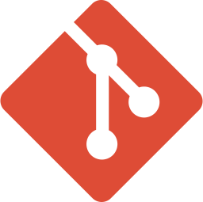

 

 As a QA with over 3 years of experience in the software industry, I have developed a rigorous and methodical approach to ensuring product quality. I have experience in manual and automated testing, as well as bug identification and reporting, and resolution tracking. Additionally, I have worked closely with developers and project managers to ensure that products meet customer requirements and technical specifications. I am passionate about quality and strive to ensure that the products delivered are of the highest possible quality.

"Quality is not an act, it is a habit." - Aristotle

**Languages and Tools:**

